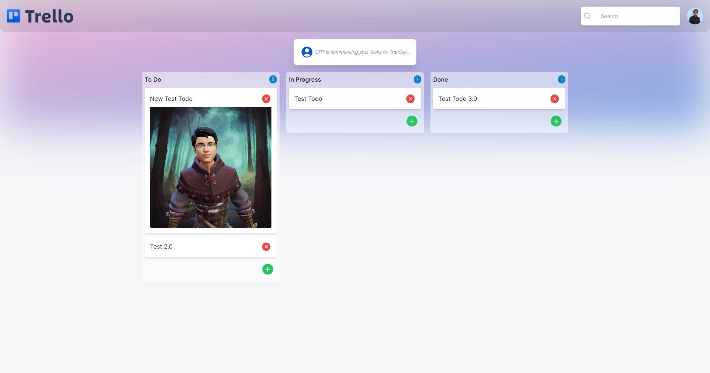
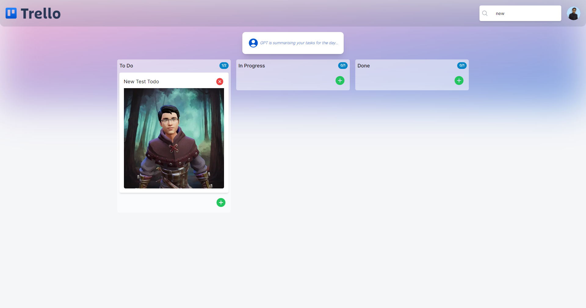
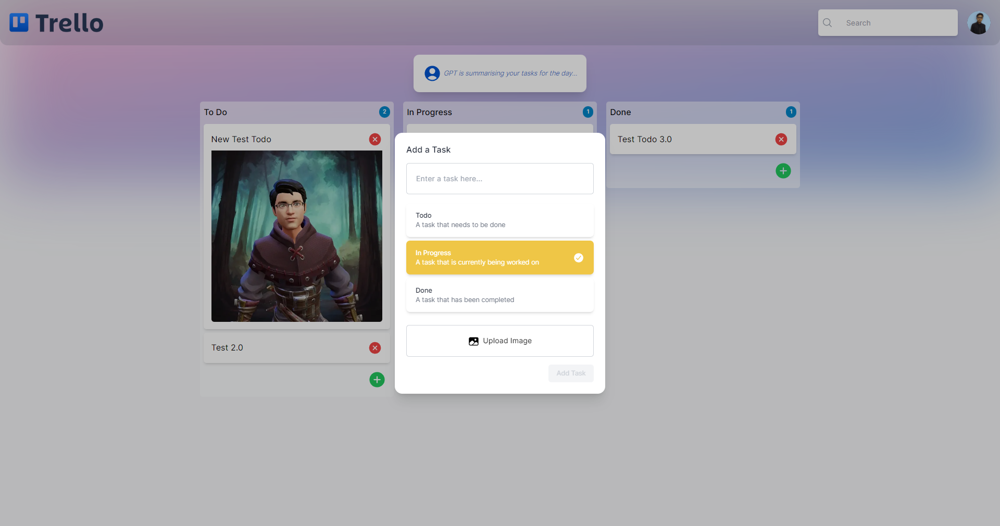

# Trello Clone with appwrite and GPT-
A simple Trello Clone using appwrite cloud and GPT-3. Also used react-beautiful-dnd package for drag and drop feature. TailwindCSS for styling. 

  

# Screenshots

